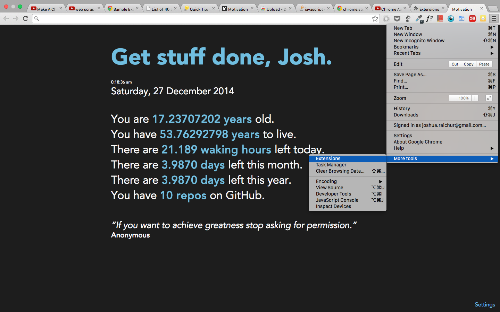
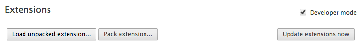

## Motivation

A simple Google Chrome Extension that replaces the "New Tab" page. Note that the life expectancy is not accurate, but it reminds me that time is actually being used up.
[View it live](http://joshuaraichur.com/motivation) on my website.

### Setup:

1. Run `git clone https://github.com/raichur/motivation.git`
2. `cd` into the directory.
3. Open the 'vars.js' file and edit the variables.
4. Open Chrome and Click on open up Extensions under the wrench menu.

5. Check "Developer Mode" and Click "Load Unpacked Extension".

6. Select the motivation directory.
